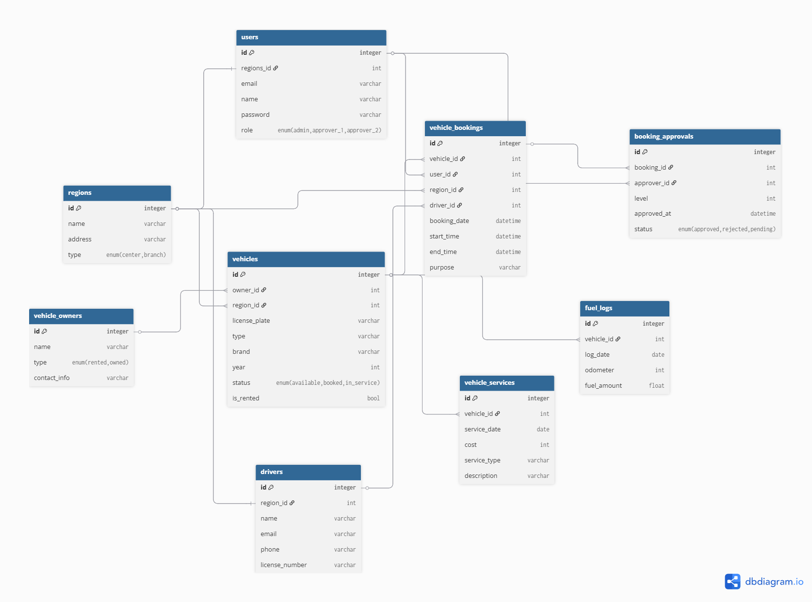
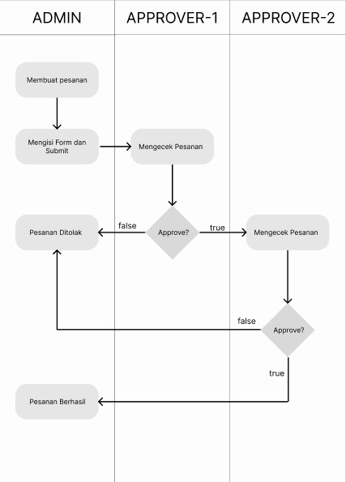
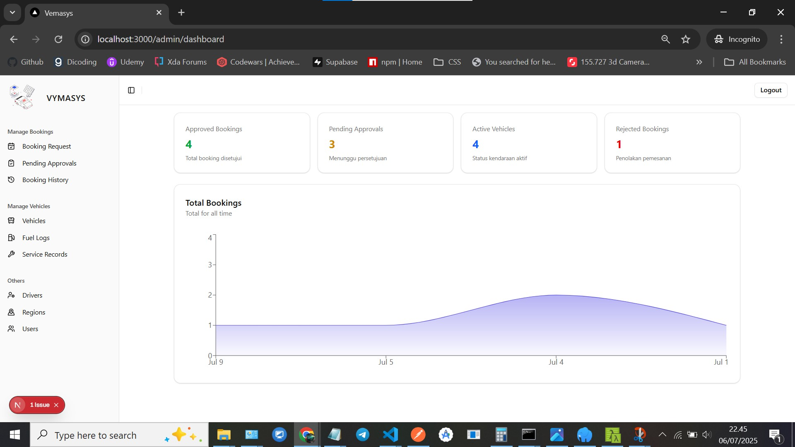
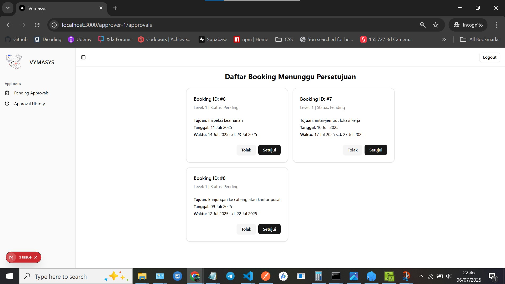
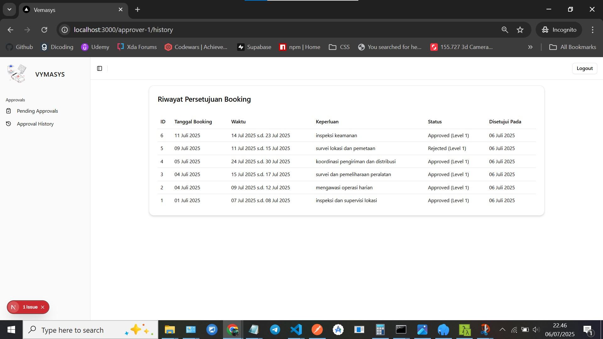
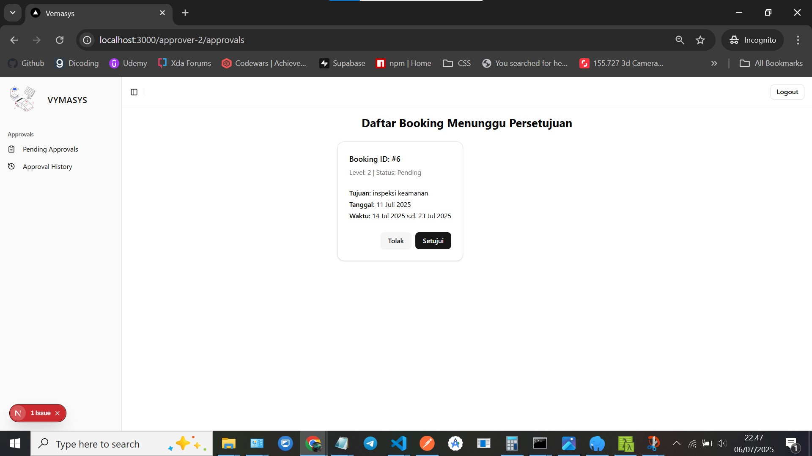
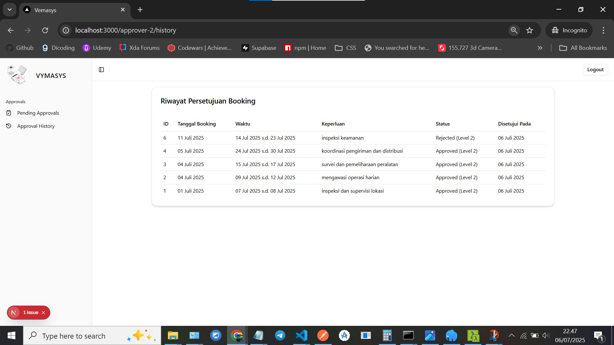

# VEMASYS

**Vehicle Management System (VEMASYS)** adalah sistem informasi berbasis web yang dirancang untuk mengelola pemesanan kendaraan di lingkungan perusahaan, dengan fitur **2 level approval** untuk memastikan proses persetujuan yang terstruktur dan bertanggung jawab.

---

## 📋 Requirements

### Backend

- PHP ≥ 8.1
- Composer
- MySQL / MariaDB
- Laravel ≥ 10.x

### Frontend

- Node.js ≥ 18.x
- NPM ≥ 9.x

---

## 🛠️ Panduan Instalasi

### Backend (Laravel)

1. Clone repository backend:

```bash
 git clone https://github.com/bagoesrex/vemasys-be.git
 cd vemasys-be
```

2. Salin konfigurasi environment:

```bash
cp .env.example .env
```

3. Generate app key (opsional tapi disarankan):

```bash
php artisan key:generate
```

4. Jalankan migrasi dan seeder

```bash
php artisan migrate --seed
```

5. Jalankan server lokal:

```bash
php artisan serve
```

### Frontend (Next.js)

1. Clone repository backend:

```bash
 git clone https://github.com/bagoesrex/vemasys-fe.git
 cd vemasys-fe
```

2. Salin konfigurasi environment:

```bash
cp .env.example .env.local
```

3. Install dependencies:

```bash
npm install
```

4. Jalankan aplikasi

```bash
npm run dev
```

Frontend akan berjalan di http://localhost:3000

---

## 👨‍💼 Akun Login

| Name       | Email                                                   | Password   | Role       |
| ---------- | ------------------------------------------------------- | ---------- | ---------- |
| Admin      | [admin@example.com](mailto:admin@example.com)           | admin      | admin      |
| Manager    | [manager@example.com](mailto:manager@example.com)       | manager    | approver-1 |
| Supervisor | [supervisor@example.com](mailto:supervisor@example.com) | supervisor | approver-2 |

---

## 🔄 Activity Diagram



---

## 🌐 Activity Diagram



---

## 🌐 App Preview

### Dashboard Admin



### Admin Pending Approvals


### Approver-1 Approvals



### Approver-1 History



### Approver-2 Approvals



### Approver-2 History


